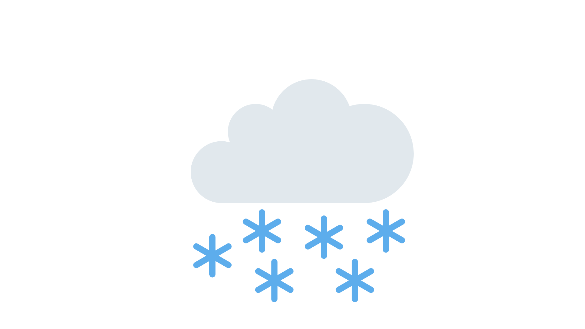

# 🌦️ Weather Forecast Web App

This web application provides weather forecasts for any city in the world for up to 5 days. It visually displays the **temperature trends** or **sky conditions** (Clear, Clouds, Rain, Snow) using an interactive and user-friendly interface.

---

## 🚀 Features

- 🌍 Get forecasts for any city worldwide
- 📅 Select forecast range (1 to 5 days)
- 🌡️ Plot temperature variations with Plotly line charts
- ☁️ Visualize sky conditions using representative icons
- 🛡️ Environment variable management using `.env` (API key protection)

---

## 🗂️ Project Structure

```text
weather_forecast_app/
│
├── main.py                # Streamlit frontend application
├── backend.py             # Handles API requests and data processing
├── .env                   # Stores your OpenWeatherMap API key
├── images/                # Folder containing weather condition icons
│   ├── clear.png
│   ├── cloud.png
│   ├── rain.png
│   └── snow.png
├── requirements.txt       # Python dependencies
└── README.md              # Project documentation

```
---

## 📦 Setup Instructions

### 1. Clone the Repository

```bash
git clone https://github.com/tanu100894/weather-forecast-webapp.git
cd weather-forecast-webapp
```

### 2. Create a Virtual Environment

```bash
python -m venv .venv
source .venv/bin/activate  # On Windows: .venv\Scripts\activate
```

### 3. Install Dependencies

```bash
pip install -r requirements.txt
```

### 4. Get an API Key
- Sign up at https://openweathermap.org/api
- Get your API key
- Create a `.env` file in the root directory and add:

```env
api_key=your_openweathermap_api_key
```

### 5. Run the App
```bash
streamlit run main.py
```
---

## 🌐 App Usage
- Enter the city name in the text field.
- Select the forecast duration (1–5 days).
- Choose between:
  - Temperature to view a line chart 
  - Sky to view weather condition icons
- If the city is not found, a graceful error message is shown.

---
## ⛅ App Preview


---

## 🔍 Example URLs (API used internally)
```http
http://api.openweathermap.org/data/2.5/forecast?q=Tirana&appid=YOUR_API_KEY
```
---

## 🛠️ Technologies Used
- **Streamlit** – for building the web interface
- **Plotly** – for dynamic data visualization
- **OpenWeatherMap API** – for forecast data
- **Python-dotenv** – for environment variable management

---
### 🖼️ Sky Condition Icons

The following images are used to represent the sky:

| Weather | Icon                                                                                          |
|---------|-----------------------------------------------------------------------------------------------|
| Clear   |  |
| Clouds  |  |
| Rain    |   |
| Snow    |   |
